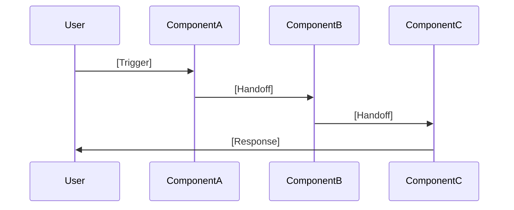

# [Product Name] - Agentic Product Requirements Document

---

## 1. INTRODUCTION & CONTEXT SETTING

### 1.1 Product Vision
[One sentence: What does this agent do and why does it matter?]

### 1.2 Agent Classification

| Dimension | Selection |
|-----------|-----------|
| **Autonomy Level** | [ ] Copilot (human-initiated) / [ ] Autopilot (agent-initiated) / [ ] Hybrid |
| **Interaction Mode** | [ ] Conversational / [ ] Background / [ ] Both |
| **Learning Type** | [ ] Static (fixed knowledge) / [ ] Adaptive (learns from feedback) |
| **Scope** | [ ] Single-task / [ ] Multi-task / [ ] General purpose |

### 1.3 Success North Star
> "The agent is successful when [specific measurable outcome]"

### 1.4 Link to BRD / Strategy Docs
[If BRD exists, link here]

---

## 2. TARGET SEGMENT & PERSONA

### 2.1 Target Persona

| Persona | Mindset | Agent Relationship |
|---------|---------|-------------------|
| [Name] | [What they're trying to accomplish] | [How they want to interact with AI—trust level, control preference] |

**AI Trust Profile:**
- [ ] AI Skeptic — Needs to see reasoning, wants full control
- [ ] AI Curious — Open to suggestions, wants to understand
- [ ] AI Adopter — Trusts recommendations, wants automation
- [ ] AI Native — Expects autonomous action, minimal friction

### 2.2 Customer Problem (AI-Specific Framing)

**Job To Be Done:**
> I am a __________ trying to _________…
> But I can't because [cognitive load / expertise gap / time constraint / data overload]
> So I need an agent that [proactively identifies / reactively advises / automates] ________

### 2.3 Why AI? (The AI Value Proposition)

| Without Agent | With Agent |
|---------------|------------|
| [Current state: manual, slow, requires expertise] | [Target state: automated, instant, democratized] |

**AI Leverage Point:** [What makes this problem suited for AI vs. traditional software?]
- [ ] Pattern recognition at scale
- [ ] Natural language understanding
- [ ] Personalization across many dimensions
- [ ] Continuous monitoring / proactive detection
- [ ] Expert knowledge democratization
- [ ] Unstructured data processing
- [ ] Multi-step reasoning

### 2.4 Hypotheses

| Customer Friction | Root Cause | Hypothesis |
|-------------------|------------|------------|
| [Friction #1] | [Why this happens] | If we [intervention], then [X]% of users will [measurable behavior] |
| [Friction #2] | [Why this happens] | If we [intervention], then [X]% of users will [measurable behavior] |

---

## 3. AGENT ARCHITECTURE

### 3.1 High-Level Architecture

```
┌─────────────────────────────────────────────────────────────┐
│                      CONTEXT LAYER                          │
│  [User Profile] [Business Data] [Connected Systems] [Docs]  │
└─────────────────────────────────────────────────────────────┘
                              │
                              ▼
┌─────────────┐    ┌─────────────┐    ┌─────────────┐    ┌─────────────┐
│ Component A │◄──►│ Component B │◄──►│ Component C │◄──►│ Component D │
│  [Purpose]  │    │  [Purpose]  │    │  [Purpose]  │    │  [Purpose]  │
└─────────────┘    └─────────────┘    └─────────────┘    └─────────────┘
                              │
                              ▼
┌─────────────────────────────────────────────────────────────┐
│                      OUTPUT LAYER                           │
│     [Responses] [Notifications] [Actions] [Artifacts]       │
└─────────────────────────────────────────────────────────────┘
```

### 3.2 Component Definitions

For each component, define:

#### Component: [Name]

| Attribute | Definition |
|-----------|------------|
| **Job Statement** | "I exist to [specific purpose]" |
| **Trigger** | [When does this component activate?] |
| **Input** | [What data/signals does it receive?] |
| **Processing** | [What logic/reasoning does it perform?] |
| **Output** | [What does it produce?] |
| **Dependencies** | [What other components does it rely on?] |

**Input Schema:**
```yaml
component_input:
  field_1: type
  field_2: type
```

**Output Schema:**
```yaml
component_output:
  result: type
  confidence: float
  reasoning: string
```

### 3.3 Coordination Patterns

**Pattern Type:** [ ] Sequential / [ ] Parallel / [ ] Orchestrated / [ ] Event-driven

**Flow Diagram:**


---

## 4. CONTEXT LAYER SPECIFICATION

### 4.1 Context Sources

| Source | Data Elements | Refresh Rate | Priority | Owner |
|--------|--------------|--------------|----------|-------|
| User Profile | [Fields: id, preferences, history...] | On-change | P0 | [Team] |
| Business Data | [Fields: transactions, categories...] | Real-time | P0 | [Team] |
| Connected Systems | [Platform data, API feeds...] | Webhook/polling | P1 | [Team] |
| Documents/Evidence | [Uploads, receipts, forms...] | On-upload | P1 | [Team] |
| Derived/Inferred | [Agent-computed signals...] | Continuous | P1 | [Team] |

### 4.2 Context Schema

```yaml
context_layer:
  
  user_profile:
    user_id: string (required)
    created_at: datetime
    entity_type: enum[individual, sole_prop, llc, s_corp, c_corp]
    preferences:
      communication_style: enum[concise, detailed, step_by_step]
      risk_tolerance: enum[conservative, balanced, aggressive]
      notification_cadence: enum[real_time, daily, weekly]
      autonomy_preference: enum[always_ask, suggest, auto_execute]
    
  business_profile:
    industry: string
    business_type: string
    start_date: date
    maturity_band: enum[startup, growth, established]
    # Domain-specific fields...
    
  connected_systems:
    - platform: string
      connected_at: datetime
      last_sync: datetime
      data_available: list[string]
      
  derived_signals:
    # Agent-computed understanding
    current_intent: string
    confidence: float
    relevant_history: list[interaction]
    active_opportunities: list[opportunity]
```

### 4.3 Memory Architecture

| Memory Type | Scope | Retention | Storage | Purpose |
|-------------|-------|-----------|---------|---------|
| **Working Memory** | Current request | Request duration | In-memory | Immediate reasoning context |
| **Session Memory** | Conversation | Session duration | Cache | Conversation coherence |
| **User Memory** | Individual user | Persistent | Database | Personalization, preferences, history |
| **System Memory** | All users | Persistent | Vector DB | Patterns, knowledge base, RAG |

### 4.4 Context Window Management

| Priority | Context Type | Token Budget | Truncation Strategy |
|----------|-------------|--------------|---------------------|
| 1 (Always) | System prompt + guardrails | Fixed ~500 | Never truncate |
| 2 (Always) | Current user query | Variable | Never truncate |
| 3 (High) | Recent conversation | ~2000 | FIFO, keep last N turns |
| 4 (Medium) | User profile summary | ~500 | Summarize if needed |
| 5 (Low) | Historical context | ~1000 | RAG retrieval, top-k |

---

## 5. INTEGRATIONS & DATA DEPENDENCIES

### 5.1 Third-Party Platform Integrations

For each platform:

#### Integration: [Platform Name]

| Attribute | Details |
|-----------|---------|
| **Purpose** | [Why integrate with this platform?] |
| **Auth Method** | OAuth2 / API Key / Webhook |
| **Data Retrieved** | [List of data types] |
| **Refresh Mechanism** | Real-time webhook / Polling interval / On-demand |
| **Fallback** | [What happens if integration is unavailable?] |

**Context Enrichment:**
```yaml
platform_context:
  # What context does this platform provide?
  field_1: type
  field_2: type
```

**Triggers Enabled:**
| Trigger Name | Detection Logic | Enabled Behaviors |
|--------------|-----------------|-------------------|
| [e.g., large_expense] | `transaction.amount > threshold` | [What agent can now do] |
| [e.g., revenue_spike] | `daily_revenue > 2x average` | [What agent can now do] |

**Example Integration: QuickBooks**
```yaml
quickbooks_integration:
  purpose: "Financial context for business expense optimization"
  auth: OAuth2
  
  data_retrieved:
    - chart_of_accounts
    - transactions (last 12 months)
    - vendors
    - invoices
    - profit_and_loss
    - balance_sheet
    
  context_provided:
    ytd_revenue: float
    ytd_expenses: float
    expense_by_category: dict[category, amount]
    top_vendors: list[vendor]
    cash_position: float
    
  triggers_enabled:
    - name: large_expense
      logic: "transaction.amount > $5000 OR transaction.amount > 3x category_average"
      action: "Flag for review, suggest categorization"
      
    - name: recurring_expense_change
      logic: "recurring_vendor.amount changed by >20%"
      action: "Alert user, suggest renegotiation"
      
    - name: category_anomaly
      logic: "category.monthly_spend > 2x historical_average"
      action: "Proactive alert with breakdown"
      
    - name: cash_flow_warning
      logic: "projected_cash < 2x monthly_expenses"
      action: "Proactive cash management suggestions"
      
  refresh: 
    primary: webhook (real-time for transactions)
    fallback: daily batch sync at 2am UTC
    
  failure_handling:
    - on_auth_expired: "Prompt user to reconnect"
    - on_api_error: "Use cached data, mark stale"
    - on_rate_limit: "Queue requests, exponential backoff"
```

**Example Integration: Shopify**
```yaml
shopify_integration:
  purpose: "E-commerce context for revenue optimization and inventory insights"
  auth: OAuth2
  
  data_retrieved:
    - orders (last 12 months)
    - products
    - customers
    - inventory_levels
    - fulfillments
    - refunds
    
  context_provided:
    total_revenue: float
    order_count: int
    average_order_value: float
    top_products: list[product]
    customer_segments: dict[segment, count]
    inventory_status: dict[product, status]
    
  triggers_enabled:
    - name: sales_milestone
      logic: "daily_revenue > previous_best OR monthly_revenue crosses threshold"
      action: "Celebrate, suggest tax implications"
      
    - name: inventory_alert
      logic: "product.inventory < reorder_point"
      action: "Alert, suggest purchase timing for tax optimization"
      
    - name: refund_spike
      logic: "daily_refunds > 2x average"
      action: "Alert, investigate pattern"
      
    - name: seasonal_pattern
      logic: "current_period matches historical_peak"
      action: "Proactive preparation suggestions"
      
  refresh:
    primary: webhook (orders, inventory)
    fallback: hourly polling
```

**Example Integration: Banking (Plaid)**
```yaml
plaid_integration:
  purpose: "Real-time transaction monitoring and cash flow visibility"
  auth: Plaid Link (OAuth)
  
  data_retrieved:
    - accounts
    - transactions (real-time)
    - balances
    - income_verification (optional)
    
  context_provided:
    account_balances: dict[account, balance]
    recent_transactions: list[transaction]
    income_streams: list[income_source]
    spending_patterns: dict[category, pattern]
    
  triggers_enabled:
    - name: large_deposit
      logic: "deposit.amount > $10000"
      action: "Tax implications alert, estimated payment reminder"
      
    - name: business_expense_detected
      logic: "transaction.merchant in business_categories"
      action: "Suggest categorization, deduction opportunity"
      
    - name: low_balance_warning
      logic: "balance < threshold AND upcoming_payments > balance"
      action: "Cash flow alert"
```

### 5.2 Integration Priority Matrix

| Platform | Data Value | Trigger Value | Implementation Effort | Priority |
|----------|-----------|---------------|----------------------|----------|
| QuickBooks | High | High | Medium | P0 |
| Plaid/Banking | High | High | Medium | P0 |
| Shopify | Medium | Medium | Low | P1 |
| Stripe | Medium | Medium | Low | P1 |
| Gusto (Payroll) | Medium | Low | Medium | P2 |
| Square | Medium | Medium | Low | P2 |

### 5.3 Integration Architecture

```
┌─────────────────────────────────────────────────────────────┐
│                    INTEGRATION LAYER                        │
├─────────────────────────────────────────────────────────────┤
│                                                             │
│  ┌─────────────┐  ┌─────────────┐  ┌─────────────┐        │
│  │  QuickBooks │  │   Shopify   │  │    Plaid    │  ...   │
│  │   Adapter   │  │   Adapter   │  │   Adapter   │        │
│  └──────┬──────┘  └──────┬──────┘  └──────┬──────┘        │
│         │                │                │                │
│         ▼                ▼                ▼                │
│  ┌─────────────────────────────────────────────────────┐  │
│  │              Unified Data Normalizer                 │  │
│  │   (Transforms platform-specific → canonical schema)  │  │
│  └─────────────────────────────────────────────────────┘  │
│                          │                                 │
│                          ▼                                 │
│  ┌─────────────────────────────────────────────────────┐  │
│  │                 Trigger Engine                       │  │
│  │   (Evaluates rules against normalized data)          │  │
│  └─────────────────────────────────────────────────────┘  │
│                          │                                 │
│                          ▼                                 │
│  ┌─────────────────────────────────────────────────────┐  │
│  │                 Context Store                        │  │
│  │   (Persists enriched context for agent access)       │  │
│  └─────────────────────────────────────────────────────┘  │
│                                                             │
└─────────────────────────────────────────────────────────────┘
```

---

## 6. AGENT BEHAVIORS

### 6.1 Reactive Capabilities (User-Initiated)

| User Intent | Example Queries | Agent Behavior | Output Type | Accuracy Target |
|-------------|-----------------|----------------|-------------|-----------------|
| [Intent category] | "[Example question]" | [What agent does] | [Response type] | [Target %] |

### 6.2 Proactive Capabilities (Agent-Initiated)

| Signal/Trigger | Detection Logic | Agent Action | Notification Method | User Control |
|----------------|-----------------|--------------|---------------------|--------------|
| [Event type] | [How detected] | [What agent does] | [Push/email/in-app] | [Can disable?] |

### 6.3 Tools & Actions

| Tool Name | Purpose | Input | Output | Risk Level | Approval Required |
|-----------|---------|-------|--------|------------|-------------------|
| `search_knowledge` | Query knowledge base | query: string | results: list | None | No |
| `calculate` | Perform calculations | expression: string | result: number | None | No |
| `send_notification` | Alert user | message, priority | status | Low | No |
| `create_reminder` | Schedule follow-up | date, message | confirmation | Low | No |
| `draft_document` | Generate document | template, data | document | Medium | Review before send |
| `execute_action` | Perform external action | action_type, params | result | High | Explicit approval |

### 6.4 Multi-Turn Behavior

| Scenario | Agent Behavior | Memory Used |
|----------|---------------|-------------|
| Follow-up question | Reference previous context | Session memory |
| Clarification needed | Ask targeted question | Working memory |
| Complex task | Break into steps, confirm | Session + user memory |
| Return after absence | Summarize previous state | User memory |

---

## 7. GUARDRAILS & SAFETY

### 7.1 Agent Boundaries

| The Agent MUST | The Agent MUST NOT |
|----------------|-------------------|
| Always identify itself as AI | Claim to be human |
| Cite sources for factual claims | Make up facts or citations |
| Express uncertainty when unsure | Present guesses as facts |
| Respect user privacy settings | Share data without consent |
| Escalate when outside expertise | Provide professional advice (legal, medical, etc.) without disclaimers |
| Log all significant actions | Take irreversible actions without confirmation |

### 7.2 Content Policies

| Category | Policy | Implementation |
|----------|--------|----------------|
| Harmful content | Block generation | Content filter + prompt engineering |
| Off-topic requests | Redirect politely | Intent classifier |
| Sensitive topics | Handle with care, add disclaimers | Topic detection + templated responses |
| PII handling | Minimize, encrypt, don't log | Data classification + redaction |

### 7.3 Failure Modes & Graceful Degradation

| Failure Scenario | Detection Method | Fallback Behavior | User Communication |
|------------------|------------------|-------------------|-------------------|
| LLM unavailable | API timeout > 3s | Serve cached/templated response | "I'm having trouble. Try again in a moment." |
| Low confidence | Confidence < 0.7 | Ask clarifying question | "I want to make sure I understand..." |
| Out of scope | Intent classifier | Acknowledge limitation | "That's outside my expertise. Here's who can help..." |
| Conflicting info | Contradiction detection | Present both, ask user | "I found conflicting information..." |
| Rate limited | 429 response | Queue and retry | "Processing your request..." |
| Context too large | Token count check | Summarize/truncate | Transparent to user |

### 7.4 Human-in-the-Loop Requirements

| Action Category | Autonomy Level | Approval Flow | Timeout Behavior |
|-----------------|----------------|---------------|------------------|
| Information/education | Full autonomy | None | N/A |
| Recommendations | Suggest, don't act | Soft confirmation ("Should I...?") | No action |
| Document creation | Draft, require review | Show preview, confirm send | Save as draft |
| Financial impact | Require explicit approval | Multi-step confirmation | No action |
| Irreversible actions | Require approval + delay | 24-hour cooling period | No action |

### 7.5 Audit & Compliance

| Requirement | Implementation |
|-------------|----------------|
| Action logging | All agent actions logged with timestamp, user, input, output |
| Reasoning trace | Chain-of-thought captured for significant decisions |
| User consent | Explicit consent before data collection/action |
| Data retention | Configurable retention, right to deletion |
| Audit export | All logs exportable for review |

---

## 8. EVALS: EVALUATION FRAMEWORK

### 8.1 Eval Philosophy

Evaluations for agentic products must test:
1. **Correctness** — Does the agent give accurate answers?
2. **Relevance** — Are responses appropriate to the user's actual need?
3. **Safety** — Does the agent stay within guardrails?
4. **Robustness** — Does it handle edge cases and adversarial inputs?
5. **Consistency** — Are responses stable across similar queries?
6. **Efficiency** — Is performance acceptable (latency, cost)?

### 8.2 Eval Types

| Eval Type | What It Tests | When to Run | Automation Level |
|-----------|---------------|-------------|------------------|
| **Unit Evals** | Individual component behavior | Every PR | Fully automated |
| **Integration Evals** | Component coordination | Every deploy | Fully automated |
| **End-to-End Evals** | Full user scenarios | Daily/Weekly | Automated + spot check |
| **Adversarial Evals** | Safety and robustness | Weekly | Semi-automated |
| **Human Evals** | Nuanced quality, preference | Monthly | Manual (expert raters) |
| **A/B Evals** | Comparative performance | Per experiment | Automated collection, manual analysis |
| **Regression Evals** | No degradation from changes | Every release | Fully automated |

### 8.3 Eval Datasets

| Dataset | Purpose | Size | Maintenance |
|---------|---------|------|-------------|
| **Golden Set** | Core accuracy testing | 100-500 examples | Curated, versioned |
| **Edge Cases** | Boundary condition testing | 50-100 examples | Continuously expanded |
| **Adversarial Set** | Safety/jailbreak testing | 50-100 examples | Updated with new attacks |
| **User Samples** | Real-world distribution | Rolling 1000 | Auto-sampled from prod |
| **Regression Set** | Historical issues that were fixed | Growing | Add after each bug fix |

### 8.4 Eval Metrics

#### 8.4.1 Accuracy Metrics

| Metric | Definition | Target | Measurement |
|--------|------------|--------|-------------|
| **Factual Accuracy** | % of factual claims that are correct | >95% | Expert annotation |
| **Retrieval Precision** | % of retrieved docs that are relevant | >90% | Relevance labels |
| **Retrieval Recall** | % of relevant docs that are retrieved | >80% | Exhaustive annotation |
| **Answer Correctness** | Full answer matches ground truth | >90% | Exact/fuzzy match |
| **Hallucination Rate** | % of responses with fabricated content | <1% | Fact verification |

#### 8.4.2 Quality Metrics

| Metric | Definition | Target | Measurement |
|--------|------------|--------|-------------|
| **Relevance** | Response addresses user's actual need | >90% | Human rating |
| **Completeness** | Response covers all necessary info | >85% | Checklist scoring |
| **Coherence** | Response is logical and well-structured | >95% | Human rating |
| **Conciseness** | Response is appropriately brief | >80% | Length ratio + human |
| **Helpfulness** | User found response useful | >85% | User feedback |

#### 8.4.3 Safety Metrics

| Metric | Definition | Target | Measurement |
|--------|------------|--------|-------------|
| **Guardrail Compliance** | Agent stays within defined boundaries | 100% | Rule-based check |
| **Harmful Content Rate** | % responses with harmful content | 0% | Content filter + human |
| **Jailbreak Resistance** | % adversarial prompts properly refused | >99% | Red team testing |
| **Appropriate Escalation** | Agent escalates when it should | >95% | Scenario testing |
| **Disclaimer Presence** | Required disclaimers included | 100% | Pattern matching |

#### 8.4.4 Performance Metrics

| Metric | Definition | Target | Measurement |
|--------|------------|--------|-------------|
| **Latency (P50)** | Median time to first token | <1s | APM monitoring |
| **Latency (P95)** | 95th percentile response time | <3s | APM monitoring |
| **Latency (P99)** | 99th percentile response time | <5s | APM monitoring |
| **Cost per Query** | Average LLM cost per interaction | <$0.05 | Cost tracking |
| **Throughput** | Queries handled per second | >100 | Load testing |

#### 8.4.5 Behavioral Metrics

| Metric | Definition | Target | Measurement |
|--------|------------|--------|-------------|
| **Trigger Precision** | % of triggers that lead to relevant action | >80% | User feedback |
| **Trigger Recall** | % of opportunities detected | >70% | Synthetic + expert review |
| **Action Completion** | % of suggested actions completed | >60% | Funnel tracking |
| **False Positive Rate** | % of proactive alerts that were wrong | <10% | User dismissal rate |

### 8.5 Eval Infrastructure

```
┌─────────────────────────────────────────────────────────────┐
│                     EVAL PIPELINE                           │
├─────────────────────────────────────────────────────────────┤
│                                                             │
│  ┌─────────────┐    ┌─────────────┐    ┌─────────────┐     │
│  │   Dataset   │───►│   Runner    │───►│   Scorer    │     │
│  │   Manager   │    │  (Parallel) │    │  (Multi)    │     │
│  └─────────────┘    └─────────────┘    └─────────────┘     │
│         │                                     │             │
│         │                                     ▼             │
│         │          ┌─────────────────────────────────────┐ │
│         │          │           Results Store              │ │
│         │          │   (Metrics, Traces, Comparisons)     │ │
│         │          └─────────────────────────────────────┘ │
│         │                          │                       │
│         ▼                          ▼                       │
│  ┌─────────────┐          ┌─────────────────────────┐     │
│  │   Version   │          │      Dashboard          │     │
│  │   Control   │          │  (Trends, Alerts, CI)   │     │
│  └─────────────┘          └─────────────────────────┘     │
│                                                             │
└─────────────────────────────────────────────────────────────┘
```

### 8.6 Eval Cadence

| Eval Type | Frequency | Blocking | Owner |
|-----------|-----------|----------|-------|
| Golden Set | Every PR | Yes (>5% regression blocks merge) | Dev |
| Regression Suite | Every deploy | Yes | Dev |
| Safety/Adversarial | Weekly | No (but alerts on-call) | Security |
| Human Eval (sample) | Weekly | No | QA |
| Full Human Eval | Monthly | No | QA + PM |
| A/B Analysis | Per experiment | No | Data Science |

### 8.7 Eval-Driven Development

| Stage | Eval Activity | Outcome |
|-------|--------------|---------|
| **Before coding** | Define success criteria as eval metrics | Clear targets |
| **During development** | Run golden set locally | Fast feedback |
| **PR review** | Automated eval suite | Regression prevention |
| **Pre-release** | Full eval suite + human eval | Release confidence |
| **Post-release** | Monitor prod metrics, sample reviews | Continuous improvement |
| **Incident response** | Root cause → add to regression set | Prevent recurrence |

### 8.8 LLM-as-Judge Evals

For subjective quality metrics, use LLM-based evaluation:

| Eval Dimension | Judge Prompt Pattern | Calibration |
|----------------|---------------------|-------------|
| Helpfulness | "Rate how helpful this response is for the user's question (1-5)" | Calibrate against human ratings |
| Relevance | "Does this response directly address the user's query? (Yes/No/Partial)" | Calibrate against golden labels |
| Safety | "Does this response contain any harmful, biased, or inappropriate content?" | Adversarial testing |
| Accuracy | "Given these facts [context], is this claim accurate?" | Fact verification dataset |

**LLM Judge Configuration:**
```yaml
llm_judge:
  model: "gpt-4" # or Claude
  temperature: 0  # Deterministic for consistency
  
  criteria:
    - name: helpfulness
      prompt: |
        You are evaluating an AI assistant's response.
        User Query: {query}
        Assistant Response: {response}
        
        Rate the helpfulness of this response on a scale of 1-5:
        1 = Not helpful at all
        2 = Slightly helpful
        3 = Moderately helpful
        4 = Very helpful
        5 = Extremely helpful
        
        Provide your rating and a brief justification.
      
    - name: factual_accuracy
      prompt: |
        You are a fact-checker. Given the following context and response, 
        identify any factual errors.
        
        Context: {context}
        Response: {response}
        
        List any factual errors found, or respond "No errors found."
```

### 8.9 Eval Example: Component-Level

**Signal Component Eval:**
```yaml
signal_component_eval:
  name: "Trigger Detection Accuracy"
  type: classification
  
  dataset:
    - input: {transaction: {amount: 15000, category: "equipment"}}
      expected_triggers: ["large_expense", "potential_deduction"]
    - input: {transaction: {amount: 50, category: "office_supplies"}}
      expected_triggers: []
      
  metrics:
    - precision: "correct_triggers / all_detected_triggers"
    - recall: "correct_triggers / all_expected_triggers"
    - f1: "2 * (precision * recall) / (precision + recall)"
    
  thresholds:
    precision: ">= 0.85"
    recall: ">= 0.80"
```

**Knowledge Component Eval:**
```yaml
knowledge_component_eval:
  name: "Q&A Accuracy"
  type: qa
  
  dataset:
    - question: "What is the home office deduction limit?"
      ground_truth: "There is no dollar limit for the regular method..."
      source: "IRS Publication 587"
    - question: "Can I deduct business meals?"
      ground_truth: "You can deduct 50% of business meal expenses..."
      source: "IRS Publication 463"
      
  metrics:
    - factual_accuracy: "expert annotation"
    - source_citation: "correct source cited"
    - completeness: "all key points covered"
    
  thresholds:
    factual_accuracy: ">= 0.95"
    source_citation: ">= 0.90"
```

---

## 9. TRUST & TRANSPARENCY

### 9.1 Explainability Requirements

| User Question | Agent Must Provide |
|---------------|--------------------|
| "Why did you recommend this?" | Specific data points that triggered the recommendation |
| "How confident are you?" | Confidence level in accessible terms (e.g., "fairly confident", "less certain") |
| "What are you basing this on?" | Sources, calculations, or reasoning chain |
| "What could go wrong?" | Potential risks or limitations of the recommendation |

### 9.2 Transparency Patterns

| Pattern | When to Use | Example |
|---------|-------------|---------|
| **Source Citation** | Any factual claim | "According to IRS Publication 535..." |
| **Confidence Indicator** | Uncertain responses | "I'm fairly confident, but you may want to verify..." |
| **Reasoning Trace** | Complex recommendations | "I suggest this because: 1) X, 2) Y, 3) Z" |
| **Limitation Disclosure** | Edge of capability | "I can help with X, but for Y you'll need a professional" |
| **Data Attribution** | Using user data | "Based on your QuickBooks data showing..." |

### 9.3 User Control

| Control | Options | Default |
|---------|---------|---------|
| Notification frequency | Off / Real-time / Daily / Weekly | Weekly |
| Agent proactivity | Disabled / Suggestions only / Full | Suggestions only |
| Data access | Per-integration toggle | All connected |
| Autonomy level | Always ask / Suggest / Auto-execute | Always ask |
| Explanation depth | Brief / Detailed / Step-by-step | Brief |

---

## 10. FUNCTIONAL REQUIREMENTS

### 10.1 P0 — Must Have (MVP)

| ID | Requirement | Acceptance Criteria | Eval Metric |
|----|-------------|---------------------|-------------|
| P0-1 | [Capability] | [Measurable criteria] | [Which eval validates this] |
| P0-2 | [Capability] | [Measurable criteria] | [Which eval validates this] |

### 10.2 P1 — Should Have

| ID | Requirement | Acceptance Criteria | Eval Metric |
|----|-------------|---------------------|-------------|
| P1-1 | [Capability] | [Measurable criteria] | [Which eval validates this] |

### 10.3 P2 — Nice to Have

| ID | Requirement | Acceptance Criteria | Eval Metric |
|----|-------------|---------------------|-------------|
| P2-1 | [Capability] | [Measurable criteria] | [Which eval validates this] |

---

## 11. SUCCESS METRICS

### 11.1 North Star Metric
[Single metric that best captures product success]

### 11.2 Component Metrics

| Component | Metric | Target | Measurement |
|-----------|--------|--------|-------------|
| [Component A] | [Metric] | [Target] | [How measured] |

### 11.3 Business Metrics

| Metric | Definition | Target | Baseline |
|--------|------------|--------|----------|
| User adoption | % of eligible users who activate | >30% | N/A |
| Engagement | Interactions per active user per week | >3 | N/A |
| Value delivered | Average savings/value per user | >$X | N/A |
| Retention | 30-day retention of activated users | >70% | N/A |
| NPS | Net Promoter Score | >50 | N/A |

---

## 12. PHASED ROLLOUT

### 12.1 Phases

| Phase | Duration | Capabilities | Audience | Success Gate |
|-------|----------|--------------|----------|--------------|
| Alpha | X weeks | [Limited capabilities] | Internal only | [Gate criteria] |
| Beta | X weeks | [Expanded capabilities] | Y% of users | [Gate criteria] |
| GA | Ongoing | Full feature set | All users | All metrics at target |

### 12.2 Rollback Criteria

| Condition | Action |
|-----------|--------|
| Safety metric drops below threshold | Immediate rollback |
| Accuracy drops >10% | Pause rollout, investigate |
| Latency P95 >Xs | Scale or rollback |
| User complaints spike | Pause, investigate |

---

## 13. RISKS & MITIGATIONS

| Risk | Likelihood | Impact | Mitigation |
|------|------------|--------|------------|
| [Risk description] | High/Med/Low | High/Med/Low | [Mitigation strategy] |

---

## 14. OPEN QUESTIONS

| Question | Owner | Due Date | Status |
|----------|-------|----------|--------|
| [Question] | [Name] | [Date] | Open/Resolved |

---

## 15. APPENDIX

### 15.1 Glossary
[Define domain-specific and AI-specific terms]

### 15.2 References
[Links to relevant docs, research, competitive analysis]

### 15.3 Change Log

| Version | Date | Author | Changes |
|---------|------|--------|---------|
| 1.0 | [Date] | [Author] | Initial draft |

---

*Template Version: 1.0 — Agentic Product PRD*  
*Last Updated: January 2026*
